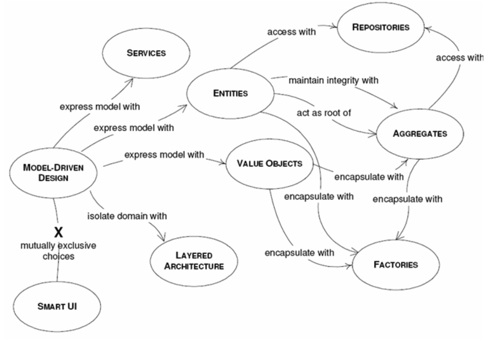

### 목차

- 의의
- 구성
  - Ubiqutous Language
  - Model-Driven Design
- What & Why
  - 비즈니스 도메인
  - 도메인 복잡성 관리
  - 바운디드 컨텍스트 연동
  - 다른 방법론 및 패턴과의 관계
    - MSA
    - 이벤트 주도 아키텍처
    - 데이터 메시
- How
  - 계층형 아키텍처
    - Layer 별 특징과 역할 파악하기

### 의의

모델이 그 가치를 잃지 않고 소프트웨어 개발에 기여하도록 도메인을 잘 표현한 모델을 만들고, 함께 끝까지 그 모델을 바라보도록 코딩하는 것입니다.

### 구성

- Ubiqutous Language : 모든 사람이 모델에 나타나 있는 용어(같은 언어)를 사용해야 합니다.
- Model-Driven Design : 또 해당 도메인의 정수만이 표현되어야 합니다.

### What

- 바운디드 컨텍스트
  - 정의 : 하위 도메인마다 사용하는 용어가 다르기 때문에 올바른 도메인 모델을 개발하려면 하위 도메인마다 모델을 만들어야 한다. 모델은 특정한 컨텍스트(문맥)하에서 완전한 의미를 갖는데, 이렇게 구분되는 경계를 갖는 컨텍스트를 바운디드 컨텍스트라고 말한다.

### Layer 별 특징과 역할

- 계층 구성요소
  - Entity
    - 식별자를 가지며 영속성이 필요한 객체를 말함.
  - Value Object
    - 식별자가 없고 영속성이 필요 없는 객체를 말함.
    - 수정할 수 없고 필요한 만큼 복제하여 전달하여 사용한다.
  - Service
    - 특정 엔티티나 값 객체에 속할 수 없는 도메인의 개념 표현함.
    - 주로 여러 객체에 걸쳐서 일어나는 행위를 담당한다.
    - 상태 정보를 관리하지 않는다.
  - Aggregation
    - 객체의 소유권과 경계를 정의한다.
    - 데이터를 변경할 때 하나의 단위로 간주되는 관련된 객체들의 집합을 말함.
    - 외부에서 접근할 수 잇는 단 하나의 창구인 root를 가짐.
  - Factory
    - 복잡한 객체 생성의 절차를 캡슐화한다.
  - Repository
    - 객체의 저장을 담당한다.
- 계층별 의미
  - 사용자 인터페이스
    - 사용자에게 정보를 보여주고 사용자의 명령을 해석하는 책임을 진다. 간혹 사람이 아닌 다른 컴퓨터 시스템이 외부 행위자가 되기도 한다.
  - 응용 계층
    - 수행할 작업을 정의하고 표현력 있는 도메인 객체가 문제를 해결하게 한다. 이 계층에서 책임지는 작업은 업무상 중요하거나 다른 시스템의 응용 계층과 상호 작용하는 데 필요한 것들이다.
    - 이 계층은 얇게 유지되고, 오직 작업을 조정하고 아래에 위치한 계층에 포함된 도메인 객체의 협력자에게 작업을 위임한다.
    - 응용 계층에서는 업무 상황을 반영하는 상태가 없지만 사용자나 프로그램의 작업에 대한 진행상황을 반영하는 상태를 가질 수는 있다.
  - 도메인 계층
    - 업무 개념과 업무 상황에 관한 정보, 업무 규칙을 표현하는 일을 책임진다. 이 계층에서는 업무 상황을 반영하는 상태를 제어하고 사용하며, 그와 같은 상태 저장과 관련된 기술적인 세부사항은 인프라스트럭처에 위임한다. 이 계층은 업무용 소프트웨어의 핵심이다.
  - 인프라 스트럭쳐 계층
    - 상위 계층을 지원하는 일반화된 기술적 기능을 제공한다. 이렇나 기능에는 애플리케이션에 대한 메세지 전송, 도메인 영속화, UI에 위젯을 그리는 것 등이 있다. 또한 인프라스트럭처 계층은 아키텍처 프레임워크를 통해 네 가지 계층에 대한 상호작용 패턴을 지원할 수도 있다.

### 식별자

- 보통 DBMS로 영속성을 관리하는 시스템에서의 Entity 식별자는 Table의 PK와 매핑되는 경우가 대부분이다. DDD의 Entity 개념에서의 고유한 식별자는 중요하다.
- Entity는 자신의 생명주기 동안 형태와 내용이 급격하게 바뀔 수도 있지만 연속성은 유지해야 한다. 이렇게 변화하는 Entity를 추적하려면 식별성이 부여되어야 하고, 식별자는 해당 시스템 내에서 유일하고 변경되어선 안된다.

### 다른 방법론 및 패턴과의 관계

- MSA
  - 구성
    - 서비스 : 미리 정의된 인터페이스를 사용해 하나 이상의 역량에 접근하기 위한 메커니즘을 말한다.
  - 정의
    - 자신의 마이크로 퍼블릭 인터페이스, 마이크로 프론트 도어에 의해 정의되는 서비스를 말함.
- 이벤트 주도 아키텍처
  - 의의 : 확장성과 성능, 회복력 있는 분산 시스템을 설계하는 방법론
  - 정의 : 시스템 컴포넌트가 이벤트 메시지를 교환하면서 비동기적으로 서로 커뮤니케이션하는 아키텍처 스타일.
- 데이터 메시
  - 의의 : 데이터 분석 컨텍스트에서의 효과적인 모델링에 관해 다룸

# 참고한 서적

