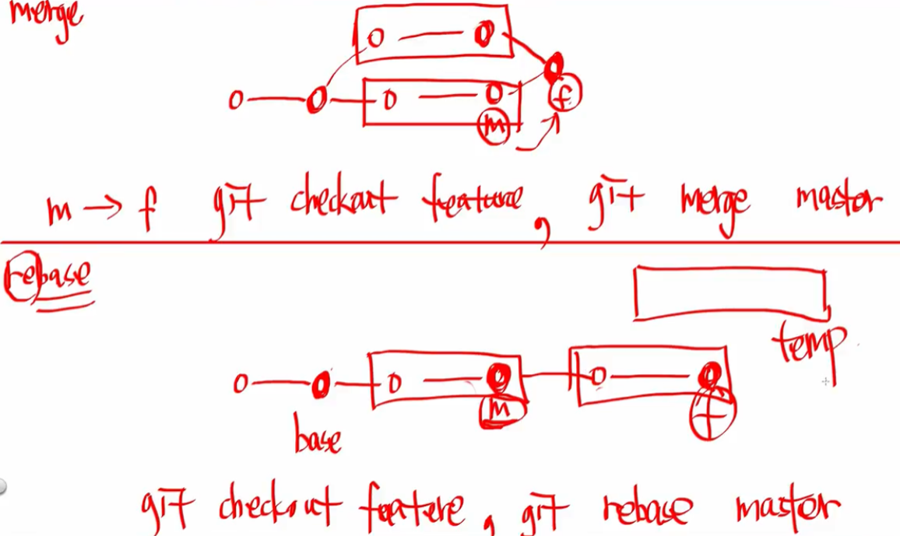

# 협업하기

### branch & merge

git branch : 브랜치 확인함. 

git branch 브랜치이름설정 : 새로운 브랜치를 생성함. 

git checkout 브랜치이름 : 생성한 브랜치로 이동함. 

git add . : 모든 파일들을 추가함. 

git commit -m "commit message" : 커밋, 메세지 작성함. 

git push origin 브랜치이름 : origin 저장소의 새로운 브랜치에 푸시함. 

git checkout master 

git merge 브랜치이름 

### Pull Request란?

Pull request를 하는 이유는 원본 레포지토리에 변경 사항을 적용하기 위함이다. 이는 관리자가 승인할 경우 원본 레포지토리에 내가 만든 코드가 commit, merge 되어 적용되므로 결국, merge되는 것은 똑같다. **결국 fork를 했느냐 안했느냐에 따라서 pull request를 하느냐, 마느냐가 결정되는 것이다.** 

### 임시저장하기

git stash : 모든 파일 임시저장

git stash pop : 임시 저장 내용 복원

git stash list : 모든 변겅점 목록을 보여줌

git stash drop : 가장 최근에 저장한 임시 저장 내용 제거

### rebase와 merge의 공통점과 차이점은 무엇인가?

결국 비슷한데, 살짝 다르다. 일단 merge의 상황은 기본적으로 3 way merge 상황이라고 생각하면 될 것이다. rebase는 master branch로 merge되는 것은 같지만, 직렬적으로 처리된다는 점에서 다르다. merge는 병렬적으로 처리되며, feature 브랜치와 develop 브랜치를 합칠 때, 3 way merge가 된다.

rebase도 병합되는 것은 마찬가지지만, 3 way merge 없이 feature 브랜치가 사라지고 develop과 같은 가지로 병합된다는 점에서 다르다.

### 2 way merge와 3 way merge의 차이점은 무엇인가?

base를 기준으로 값이 변경된 사람의 내역을 따르면 3 way merge이다. 2 way merge는 서로 다른 경우 base와 상관 없이 conflict가 뜬다.