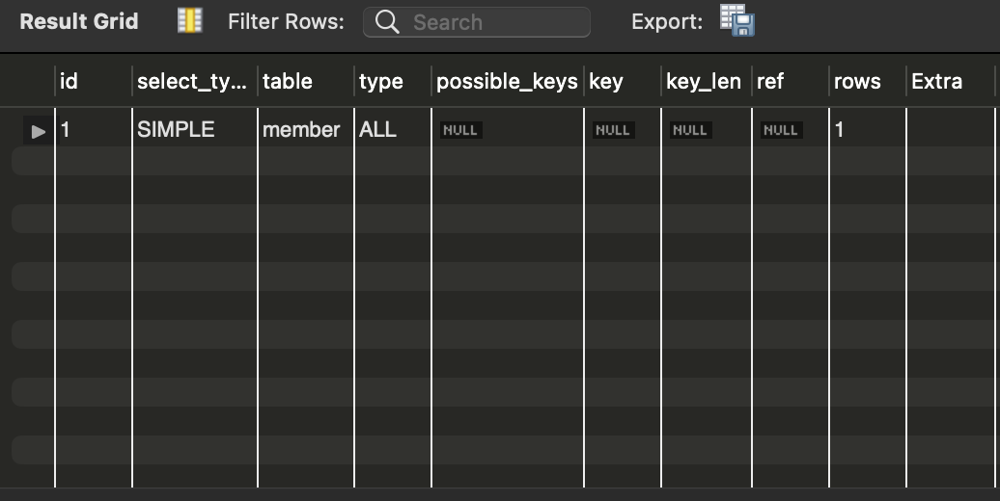

# 서론

### 실행계획과 옵티마이저, 왜 배워야 할까?

결론부터 말씀 드리면, 똑같은 결과를 만들어내는 쿼리 중에서도 가장 빠르고 효율적인 쿼리를 작성하기 위함입니다. 다시 말해, 쿼리 최적화를 위함이죠.

실행 계획이란 DMBS에서 데이터에 접근하기 위해 사용되는 단계의 순서를 의미합니다. 우리는 실행 계획을 이해할 수 있어야만 실행 계획의 불합리한 부분을 찾아내고, 더욱 최적화된 방법으로 실행 계획을 수립하도록 유도할 수 있습니다. 옵티마이저는 가장 효율적인 방법으로 SQL을 수행할 최적의 처리 경로를 생성해주는 DBMS의 핵심 엔진입니다. 컴퓨터의 두뇌가 CPU인 것처럼 **DBMS의 두뇌는 옵티마이저**라고 할 수 있습니다. 또 옵티마이저를 이해해야, 최적의 실행계획이 결정되는 원리에 관해서 알 수 있습니다.

중요성에 관해 알았으니, 실행계획과 옵티마이저에 자세하게 대해서 알아보도록 하겠습니다.

### 정의

개발자가 SQL을 작성하고 실행하면 소프트웨어 실행파일처럼 즉시 실행되는 것이 아니라 옵티마이저(Optimizer)라는 곳에서 **"이 쿼리문을 어떻게 실행시키겠다!"라는 여러 가지 실행계획을 세우게 됩니다.** 이렇게 실행계획을 세운 뒤 *시스템 통계정보를 활용하여 각 실행계획의 예상 비용을 산정한 후 각 실행계획을 비교해서 최고의 효율을 가지고 있는 실행계획을 판별한 후 그 실행계획에 따라 수행*하게 되는 것입니다.

### 동작과정

.png>)

첫번째 단계는 `SQL 파싱`입니다. MySQL 서버의 `SQL 파서`라는 모듈로 처리합니다. 만약 SQL 문장이 문법적으로 잘못됐다면 이 단계에서 걸러집니다. 또한 이 단계에서 `SQL 파스 트리`가 만들어진다. MySQL 서버는 SQL 문장 그 자체가 아니라 SQL 파스 트리를 이용해 쿼리를 실행합니다.

두번째 단계는 `최적화 및 실행계획 수립` 단계이며, MySQL 서버의 `옵티마이저`에서 처리합니다. 두 번째 단계가 완료되면 쿼리의 `실행 계획`이 만들어집니다. 대표적인 예시는 아래와 같습니다.

- 불필요한 조건의 제거 및 복잡한 연산의 단순화
- 여러 테이블의 조인이 잇는 경우 어떤 순서로 테이블을 읽을지 결정함
- 각 테이블에 사용된 조건과 인덱스 통계 정보를 이용해 사용할 인덱스 결정
- 가져온 레코드들을 임시 테이블에 넣고 다시 한번 가공해야 하는지 결정

세 번째 단계는 수립된 실행 계획대로 스토리지 엔진에 레코드를 읽어오도록 요청하고, MySQL 엔진에서는 스토리지 엔진으로부터 받은 레코드를 조인하거나 정렬하는 작업을 수행합니다.

### 스토리지 엔진이란

데이터베이스 관리 시스템(DBMS)이 데이터베이스에 대해 데이터를 삽입, 추출, 업데이트 및 삭제(CRUD 참조)하는 데 사용하는 기본 소프트웨어 컴포넌트이다. 데이터베이스 엔진을 조작할 때 DBMS 고유의 사용자 인터페이스를 이용하는 방법과 포트 번호를 통해하는 방법이 있다. 대부분의 데이터베이스 관리시스템은 DBMS 의 사용자 인터페이스를 통하지 않고, 사용자가 내장된 엔진과 상호작용을 할 수 있는 자신만의 애플리케이션 프로그래밍 인터페이스(API)를 포함하고 있다.

### 실행 계획 분석

EXPLAIN 명령어를 사용하면 된다. 아래는 예시로, member 테이블을 풀 테이블 스캔 방식으로 조회한 것이다. 

```sql
EXPLAIN SELECT * FROM member;
```



# 참고한 사이트

[https://coding-factory.tistory.com/743](https://coding-factory.tistory.com/743)
