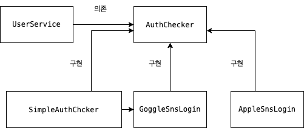

# 본론

오늘은 객체지향설계 5원칙 중 하나인 DIP에 관해서 알아보도록 하겠습니다.

## 의존성 역전 원칙 (Dependency Inversion Principle, DIP)

고수준 모듈(추상화 레벨이 높은 상위 수준의 모듈)이 저수준 모듈(추상화 레벨이 낮은 하위 모듈)에 의존하면 안된다는 것을 의미합니다.

- 고수준 모듈 : 변경이 없는 추상화된 클래스 (또는 인터페이스)
- 저수준 모듈 : 변하기 쉬운 구체 클래스



또 DIP는 추상화에 의존하며 구체화에는 의존하지 않는 설계 원칙을 의미합니다. 위의 다이어그램을 예시로 살펴보겠습니다. 회원가입과 로그인 로직을 구현해야 하는 상황이라고 가정해보겠습니다. 구현 방식에는 여러 방법이 있을 것입니다. 유저 이메일과 비밀번호 일치 여부를 검증하는 방식으로 유저의 인증 정보를 SimplePasswordChecker, 구글 소셜 로그인을 통한 GoogleSnsLogin, 애플 소셜 로그인을 통한 AppleSnsLogin이 있을 것입니다.

```java
@Service
@RequiredArgsConstructor
public class UserService {
  private GoogleSnsLogin googleSnsLogin;

  public void login(String id, String pw){
    googleSnsLogin.login(id, pw);
  }
}
```

이 때, 만약 UserService에서 변하기 쉬운 구체 클래스에 직접 의존한다면, `의존성 역전 원칙`에 위배됩니다. 그러나 세 구현체의 인턴페이스를 정의한 AuthChecker를 의존한다면, 언제든지 회원가입/로그인 정책이 변경되어도 다른 곳들로 변경이 전파되지 않으며 유연한 애플리케이션이 될 수 있습니다.

```java
public interface AuthChecker {
	String login(String pw);
	String join(String id, String pw);
	String encryptPassword(String pw);
	String isCorrectPassword(String rawPw, String pw);
}

@Service
@RequiredArgsConstructor
public class UserService {
  private AuthChecker authChecker;

  public void login(String id, String pw){
    authChecker.login(pw);
    ...
  }
}

@Component
public class GoogleSnsLogin implements AuthChecker {

	@Override
	public String login(String pw)  {
		...
	}

  @Override
	public String join(String id, String pw) {
		...
	}

  @Override
	public String encryptPassword(String pw)  {
		...
	}

  @Override
	public String isCorrectPassword(String rawPw, String pw) {
		...
	}
}
```

# 결론

짧게 DIP에 관해서 알아보았습니다. 읽어주셔서 감사합니다.

# 참고한 사이트

[https://mangkyu.tistory.com/194](https://mangkyu.tistory.com/194)
