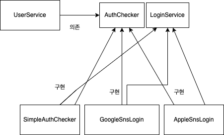

# 본론

오늘은 객체지향설계 5원칙 중 하나인 ISP에 관해서 알아보도록 하겠습니다.

## 인터페이스 분리 원칙 (Interface segregation principle, ISP)

인터페이스 분리 원칙이란 클라이언트의 목적과 용도에 적합한 인터페이스 만을 제공하는 것을 말합니다. 객체가 충분히 높은 응집도의 작은 단위로 설계됐더라도, 목적과 관심이 각기 다른 클라이언트가 있다면 인터페이스를 통해 적절하게 분리해줄 필요가 있기 때문입니다. 인터페이스 분리 원칙을 준수함으로써 모든 클라이언트가 자신의 관심에 맞는 퍼블릭 인터페이스(외부에서 접근 가능한 메세지)만을 접근하여 불필요한 간섭을 최소화할 수 있으며, 기존 클라이언트에 영향을 주지 않은 채로 유연하게 객체의 기능을 확장하거나 수정할 수 있기 때문입니다.

인터페이스 분리 원칙을 지킨다는 것은 어떤 구현체에 부가 기능이 필요하다면 이 인터페이스를 구현하는 다른 인터페이스를 만들어서 해결할 수 있다. 예를 들어 파일 읽기/쓰기 기능을 갖는 구현 클래스가 있는데 어떤 클라이언트는 읽기 작업 만을 필요로 한다면 별도의 읽기 인터페이스를 만들어 제공해주는 것입니다.


--> 한줄 다이어그램 설명

```java
@Component
public class GoogleSnsLogin implements AuthChecker {

	@Override
	public String login(final String pw)  {
		...
	}

  @Override
	public String join(final String rawPw, final String pw) {
		...
	}

  @Override
	public String encryptPassword(final String pw)  {
		...
	}

  @Override
	public String isCorrectPassword(final String rawPw, final String pw) {
		...
	}
}
```

적용 전에는 Authchecker에서 모든 로직을 처리하는 구조였습니다. 하지만 ISP 원칙에 따라, Authchecker 인터페이스에 정의된 메서드들을 LoginService와 AuthChecker로 각각을 구분 짓고 역할을 분리하도록 하겠습니다. 

```java

public interface LoginService {

	public String login(final String pw)  {
		...
	}

	public String join(final String rawPw, final String pw) {
		...
	}
}

public interface AuthChecker {
  @Override
	public String encryptPassword(final String pw)  {
		...
	}

	public String isCorrectPassword(final String rawPw, final String pw) {
		...
	}
}

@Component
public class GoogleSnsLogin implements LoginService, AuthChecker {

	@Override
	public String login(final String pw) {
		...
	}

	@Override
	public String join(final String rawPw, final String pw) {
		final String encryptedPw = login(rawPw);
		return encryptedPw.equals(pw);
	}

  ...
}
```

# 결론

짧게 ISP에 관해서 알아보았습니다. 읽어주셔서 감사합니다.

# 참고한 사이트

[https://mangkyu.tistory.com/194](https://mangkyu.tistory.com/194)
