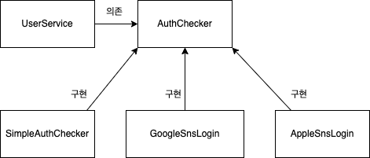

# 본론

오늘은 객체지향설계 5원칙 중 하나인 ISP에 관해서 알아보도록 하겠습니다.

## 개방 폐쇄 원칙 (Open-Closed Principle, OCP)

확장에 대해 열려있고 수정에 대해서는 닫혀있어야 한다는 원칙을 말합니다. 

- 확장에 대해 열려 있다: 요구사항이 변경될 때 새로운 동작을 추가하여 애플리케이션의 기능을 확장할 수 있다.
- 수정에 대해 닫혀 있다: 기존의 코드를 수정하지 않고 애플리케이션의 동작을 추가하거나 변경할 수 있다.

--> 한줄 다이어그램 설명

개방 폐쇄의 원칙이 본질적으로 얘기하고자 하는 것은 추상화이며, 이는 결국 런타임 의존성과 컴파일타임 의존성에 대한 이야기이다. 여기서 런타임 의존성이란 애플리케이션 실행 시점에서의 객체들의 관계를 의미하고, 컴파일타임 의존성이란 코드에 표현된 클래스들의 관계를 의미한다.

적용사례

# 결론

짧게 OCP에 관해서 알아보았습니다. 읽어주셔서 감사합니다.

# 참고한 사이트

[https://mangkyu.tistory.com/194](https://mangkyu.tistory.com/194)
