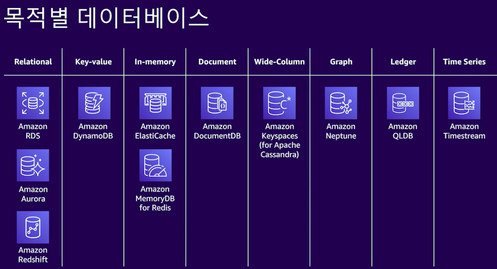

### AWS의 정의

AWS은 Amazon Web Service의 약자. AWS는 이미 엄청나게 방대한 양의 서비스를 제공합니다. 따라서 이번 시간에는 AWS의 전신인 EC2에 대해서 알아보고, 이를 통해 다른 서비스들을 이해하는 토대를 다지도록 하겠습니다.

클라우드 컴퓨팅이란 무엇일까요? **남의 컴퓨터(서버)를 빌려서 원격 제어를 통해서 사용하는 것** 이것이 바로, 클라우드 컴퓨팅의 기초입니다. 또 호스팅을 말합니다. 직접 서버를 빌려줘, 타사 서비스를 대신 운영해주는 것이죠.

이와 같은 서비스를 제공하는 아마존의 서비스가 바로 `EC2(Elastic Compute Cloud)`입니다. EC2인 이유는 단순히 C가 2개(Compute, Cloud)이기 때문입니다.

많은 기업에서 자사 서비스를 운영하기 위해 직접 서버를 설치하지 않고, 클라우드를 사용하는 까닭은 무엇일까요?

만약 최신 서버를 구축했는데 동시 접속자가 1명, 하루 접속자가 100명 밖에 오지 않았다면 비싼 서버를 구비한 것이 의미가 없어질 것입니다.

반면, 동시 접속자가 100만명, 하루 접속자가 1억 명이 오는 서비스의 서버를 구축해야 한다고 가정해보죠. 그에 맞는 서버를 구성하려면, 얼마나 많은 시간과 인력이 필요할까요? 여러분의 상상에 맡기겠습니다.

또 그 외에도 RDS(Relational Database Service)를 제공합니다. 관계형 데이터베이스를 조작할 수 있게 돕죠.

오늘은 AWS 회원가입부터 회원탈퇴, 보안설정과 요금제. 서비스의 구성과 메뉴얼을 통해 서비스에 필요한 부분을 스스로 학습할 수 있도록 볼 것입니다.

### AWS로 할 수 있는 것들

기능을 배우기 전에, 가상으로 꿈을 상정해봅시다.

Mac 사용자가 1시간만 Windows를 사용해야 하는데, 새 Windows 컴퓨터를 구매하지 않고도 사용 할 수 있다면 얼마나 좋을까요?

이번 시간엔 잠깐 빌려서 사용할 수 있는 Windows 컴퓨터를 사용해보도록 하겠습니다.

온디맨드 인스턴스를 사용하면 장기 약정 없이 컴퓨팅 파워에 대해 시간당 또는 초당(최소 60초) 비용을 지불하게 됩니다.

따라서 하드웨어를 계획, 구매, 유지 관리하는 데 수반되는 비용과 복잡성이 사라지고 일반적으로 큰 규모의 고정 비용이 훨씬 적은 가변 비용으로 전환됩니다.

### AWS 서비스와 OnPremise 비교

| onPremise   | AWS      |
| ----------- | -------- |
| 방화벽      | 보안그룹 |
| ACL         | NACL     |
| 관리자 권한 | IAM      |
| 로드밸런서  | ELB      |
| 네트워크    | VPC      |
| 서버        | EC2      |
| NAS         | EFS      |
| 디스크      | EBS      |
| DB          | RDS      |

- 방화벽
  - 기존에 단순 아이피를 차단하던것과 달리, 인터넷을 통한 공격 패턴이 점차 발달하였기에, 일상적인 트래픽을 검사하는 기능이 추가되었다. 즉 기존 패킷 필터 기반의 방화벽으로는 최근에 발생하는 공격을 방어하기 어려워지기 때문에, 패킷의 실제 내용을 검사하고, 각각 다양한 애플리케이션들에 대해서 어떠한 영향을 방화벽이 주는 것까지를 체크하여 차단하는 기능이 추가되었다.
- ACL
  - 개체나 개체 속성에 적용되어 있는 허가 목록을 말한다. 이 목록은 누가 또는 무엇이 객체 접근 허가를 받는지, 어떠한 작업이 객체에 수행되도록 허가를 받을지를 지정하고 있다.

### AWS 데이터베이스

- 관계형 DB RDS
  - MySQL, Postgre SQL 호환
  - Aurora MySQL
    - 완전 관리형 서비스
    - 표준 MySQL DB 보다 5배 빠름
    - DB 인스턴스 당 최대 64TB까지 자동 확장됨
    - 읽기 전용 복제본을 15GB까지 지원함
  - Amazon Dynamo DB
    - 관리형 noSQL 서비스
  - Amazon Document DB
    - 몽고 디비처럼 문서형 데이터를 처리할 수 있음
  - Amazon Elastic Cache
    - 인메모리 캐시 서비스로 Redis와 Memcached를 사용
  - Amazon Neptunes
    - 그래프 디비
  - QLDB
    - 모든 변경사항을 완전하고 암호로 확인할 수 있는 DB
    - 블럭체인 사용시 사용하는 DB
  - NOSQL DB, Dynamo DB
    - 짧은 지연시간
    - 문서 모델과 키 값 스토어 모델 지원
    - 완전 관리형 DB
    - 문서의 저장, 쿼리, 업데이트 지원
      - AWS SDK를 사용하여 가능함
    - 게임, 광고, 모바일, IoT 등 다양한 애플리케이션에 적합함

### 서비스 추적

- AWS 계정의 사용자 활동과 API 사용 추적이 된다. 
- 모든 API 사용 로그가 남는다. 
- S3 버킷에 로그가 남는다. 
- 감사 자료로 활용 가능하다. 

[https://brunch.co.kr/@topasvga/2502](https://brunch.co.kr/@topasvga/2502)