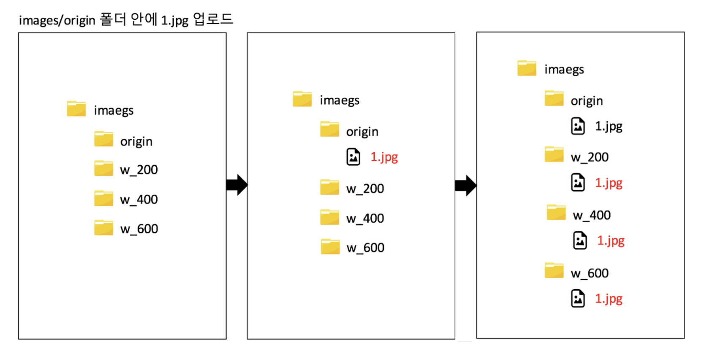

# 서론

# 본론

## 진행 과정

1. AWS Lambda 실행 설정 
2. 서버에서 S3 버킷으로 이미지 업로드
3. 해당 버킷에 걸린 람다 이벤트 발생 
4. 람다 함수가 이미지를 리사이징하고 타겟 폴더에 저장

### AWS Lambda 실행 설정

1. IAM 콘솔의 [역할 페이지](https://us-east-1.console.aws.amazon.com/iamv2/home#/roles)를 열어서 역할 만들기을 클릭 
2. 사용 사례 선택의 lambda를 클릭 
3. 검색에서 AWSLambdaExecute를 체크 
4. 태그 추가부분은 생략 
5. 생성된 역할의 이름을 지정해주고 역할 만들기 클릭 

### 버킷 생성

업로드한 이미지는 origin에 업로드 되며 이후 lambda 함수가 실행되면서 w_200/, w_400/, w_600/에 리사이징된 이미지가 저장됨
생성된 버킷에 lambda 함수를 연결해줘야 함

# 참고한 사이트 

[https://kosaf04pyh.tistory.com/334](https://kosaf04pyh.tistory.com/334)
