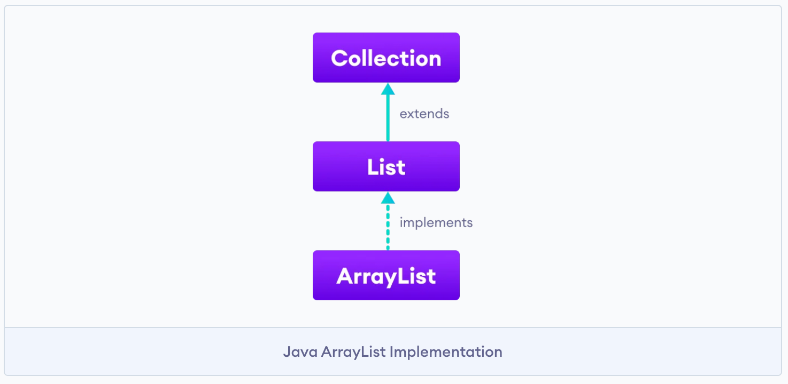

# 서론

오늘은 자바 프로그래밍을 하면서 유용하게 쓰이는 util 클래스 중 하나인 List에 관해 정리하는 시간을 갖겠습니다.

# 본론

### 컬렉션 프레임워크와의 관계

List 인터페이스는 컬렉션 프레임워크를 상속 받습니다. 따라서 컬렉션 메서드를 그대로 사용할 수 있죠. 단, 내부적으로 구현체에 따라 구현 방식과 특성에는 차이가 있습니다.

### List의 구현체 종류

또 List는 인터페이스이기 때문에, 이를 구현한 구현체는 여러 개일 수 있습니다.

- ArrayList
- LinkedList
- Vector
- Stack

### List의 특성

List 인터페이스는 중복을 허용하면서 저장순서를 유지하는 특성을 갖습니다.

### ArrayList



1. 생성

- add(int index, E element) : element를 ArrayList에 추가해줍니다. 여기서 index는 생략될 수 있습니다. 성공적으로 값이 삽입 되면, true 값을 반환합니다.
- addAll(int index, Collection c) : collection을 인자로 받아 추가해줍니다. 여기서 index는 생략될 수 있습니다. 한번에 값을 추가할 때 유용합니다. 성공적으로 값이 삽입 되면, true 값을 반환합니다.

```java
import java.util.ArrayList;

public class Main {
    public static void main(String[] args){
        ArrayList list1 = new ArrayList(10);
        list1.add(new Integer(5));
        list1.add(new Integer(4));
        list1.add(new Integer(3));
        list1.add(new Integer(2));
        list1.add(new Integer(1));

        System.out.println("list1 = " + list1); // list1 = [5, 4, 3, 2, 1]

        ArrayList list2 = new ArrayList();
        list2.addAll(list1);

        System.out.println("list2 = " + list2); // list2 = [5, 4, 3, 2, 1]
    }
}
```

2. 조회/순회/정렬

- get(int index) : 해당 인덱스의 값을 반환합니다.
- iterator() : 리스트의 요소에 순차적으로 접근할 수 있는 이터레이터 객체를 반환합니다.
- set(int index, E element) : 해당 인덱스에 값을 넣어줍니다.

```java
public class Main {
    public static void main(String[] args){
        ArrayList<String> cities = new ArrayList<>();

        cities.add("Seoul");
        cities.add("Incheon");
        cities.add("Busan");
        System.out.println("Korean cities: " + cities);

        String element = cities.get(1);
        System.out.println("Cities at index 1: " + element);

        Iterator<String> iterate = cities.iterator();
        System.out.print("ArrayList: ");

        while(iterate.hasNext()){
            System.out.print(iterate.next());
            System.out.print(", ");
        }
    }
}
```

- sort(Comparator c) : Comparator 객체를 인자로 전달해, 순서를 정렬합니다.

```java
import java.util.ArrayList;

public class Main {
    public static void main(String[] args){
        ArrayList list1 = new ArrayList(10);
        list1.add(new Integer(5));
        list1.add(new Integer(4));
        list1.add(new Integer(3));
        list1.add(new Integer(2));
        list1.add(new Integer(1));

        System.out.println("list1 = " + list1); // list1 = [5, 4, 3, 2, 1]
        Collections.sort(list1);
        System.out.println("list1 = " + list1); // list1 = [1, 2, 3, 4, 5]
        list1.sort(Comparator.naturalOrder());
    }
}
```

3. 삭제

- remove() : removes an element from the list.
- removeAll() : removes all the elements from the list.
- clear() : removes all the elements from the list (more efficient than removeAll()).

```java
import java.util.ArrayList;

public class Main {
    public static void main(String[] args){
        ArrayList list1 = new ArrayList(10);
        list1.add(new Integer(5));
        list1.add(new Integer(4));
        list1.add(new Integer(3));
        list1.add(new Integer(2));
        list1.add(new Integer(1));
    }
}
```

4. 기타

- size() : returns the length of lists.
- toArray() : converts a list into an array.
- contains() : returns true if a list contains specified element.

```java

```

## LinkedList

### 정의

### 선언방법

### 생성

● add : 데이터를 추가한다. (인덱스 지정 가능)

### 조회

● get : 특정 인덱스의 데이터를 반환한다.

### 삭제

● remove : 데이터를 삭제한다. (인덱스 혹은 데이터 지정가능)

### 기타

● size: 아이템 갯수를 반환
● contains: 특정데이터가 존재하는지 여부 반환

### 수정

- [ArrayList](https://wikidocs.net/207#arraylist)
  - [add](https://wikidocs.net/207#add)
  - [get](https://wikidocs.net/207#get)
  - [size](https://wikidocs.net/207#size)
  - [contains](https://wikidocs.net/207#contains)
  - [remove](https://wikidocs.net/207#remove)

[https://docs.oracle.com/en/java/javase/11/docs/api/java.base/java/util/List.html](https://docs.oracle.com/en/java/javase/11/docs/api/java.base/java/util/List.html)
[List (Java SE 11 & JDK 11)]
An ordered collection (also known as a sequence). The user of this interface has precise control over where in the list each element is inserted. The user can access elements by their integer index (position in the list), and search for elements in the list.
[docs.oracle.com](https://docs.oracle.com/en/java/javase/11/docs/api/java.base/java/util/List.html)
