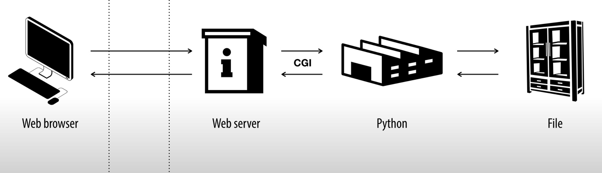

## CGI(Common Gateway Interface)란? 

서버 프로그래밍을 하면 마주하는 중요한 개념이 있다. 바로 CGI이다. 이는 `Common Gateway Interface`의 준말로 직역하면 공용 게이트웨이 인터페이스이다. `게이트웨이`는 라우터가 다른 네트워크로 들어가는 입구 역할을 하는 네트워크 포인트를 가리킬 때 사용되는 것처럼, 일종의 관문을 말한다. `인터페이스`는 CLI(Command Line Interface)가 가상 터미널 또는\[텍스트 터미널\]을 통해 사용자와 컴퓨터가 상호 작용하도록 돕듯이, 서로 다른 두 개의 시스템, 장치 사이에서 정보나 신호를 주고받는 경우의 접점이나 경계면을 말한다.



그렇다, 그렇다면 CGI는 무엇에 대한 관문이자 인터페이스인가? 이는 `웹 서버`와 `프로그래밍 언어` 사이에서 **웹을 구현하기 위해** 정보를 주고받는 방법이나 규약들을 말한다. 위에서 보면, 웹 서버와 Python(정확히는 python 언어로 작성된 CGI Script, CGI 프로그램)과 소통 과정에서 사용되는 Interface이다. 이 과정을 거친 후, 웹 페이지에서 정적으로 제공되던 파일이 사용자의 요청에 따라 동적으로 처리할 수 있는 웹 어플리케이션으로 변모하게 된다.

그러나 CGI에는 단점이 있는데, 바로 CGI 프로그램이 서버에서 프로세스 단위로 실행이 된다는 점이다. 그러다보니 사용자의 요청이 많을때 서버에 부하가 크게 가게 되고 프로세스 보다 더 작은 단위로 실행하는것이 필요했다. 그리고 웹 서버의 프로세스로서 인터프리터를 상주시키고, CGI로부터 프로그램을 호출해 (즉, 스레드 단위로 실행) 부하를 줄임으로써 성능을 개선한 Java Servlet이 등장했다.

## Node.js에서의 CGI

Node.js에선 CGI 모듈 없이도 동적으로 페이지를 처리할 수 있다. Node.js는 CGI 규약에 맞춰서 이미 구현을 완료한 상태이기 때문에 별도의 CGI 모듈이 필요없다.

### Java에서의 CGI

Servelet은 Tomcat이 이해할 수 있는 웹 서버용 클래스이다.
아래는 간단한 HTML 파일을 실행하는 Servlet 코드이다. 이를 통해, Servelet의 역할에 관해 감을 잡을 수 있으리라.

```java
package testPackage;

import java.io.IOException;
import java.io.PrintWriter;

import javax.servlet.ServletException;
import javax.servlet.annotation.WebServlet;
import javax.servlet.http.HttpServlet;
import javax.servlet.http.HttpServletRequest;
import javax.servlet.http.HttpServletResponse;

@WebServlet("/hello")
public class HelloWorld extends HttpServlet {
	private static final long serialVersionUID = 1L;

	protected void doGet(HttpServletRequest request,
			HttpServletResponse response)
					throws ServletException, IOException {

		PrintWriter out = response.getWriter();
		out.println("Hello World!");
	}
}
```

### 서블릿과 템플릿 엔진과의 차이점

## 참고사이트 

[CGI 그리고 Servlet과 JSP와의 관계](https://aahc.tistory.com/14)
[CGI와 웹서버](https://m.blog.naver.com/PostView.nhn?blogId=goddlaek&logNo=220901890910&proxyReferer=https:%2F%2Fwww.google.com%2F)
[Tomcat과 JSP](http://www.beginwithjava.com/servlet-jsp/web-application-overview/hello-world-servlet-eclipse.html)
[아파치 투토리얼: CGI를 사용한 동적 페이지 생성](https://httpd.apache.org/docs/2.4/ko/howto/cgi.html)
