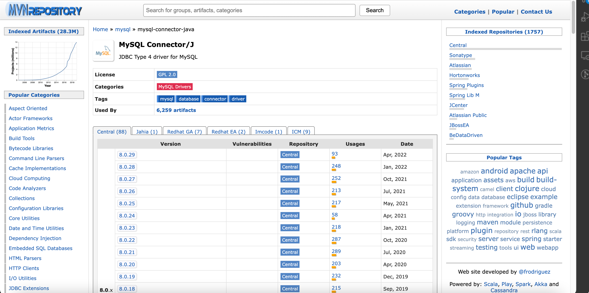

# 서론

오늘은 Spring Boot 환경에서 MySQL과 MyBatis 설정을 하는 방법에 관해서 알아보도록 하겠습니다.

### 목차

- MySQL 설치방법
- Spring Boot에서 MySQL 설정하기
- Spring Boot에서 MyBatis 설정하기

# 본론

### MySQL 설치방법

Mac을 사용한다면, 간단하게 brew로 mysql을 설치해줍니다.

```
brew install mysql
```

버젼도 확인해봅니다.

```
mysql -V
```

서버도 실행해봅니다.

```
mysql.server start
```

그리고 MySQL 초기 설정을 해줍니다. 비밀번호, 익명유저, root 접속 권한 등을 설정해줍니다.

```
mysql_secure_installation
```

그런 뒤, 접속해줍니다.

```
mysql -u root -p
```

다시 mysql 서버를 실행하고 설정을 켜줍니다.

### Spring Boot에서 MySQL 설정하기

Spring Boot가 이미 설정되어 있다는 상태를 가정하겠습니다. MySQL 설정을 위한 라이브러리는 어떻게 검색할 수 있을까요? [https://mvnrepository.com/](https://mvnrepository.com/)에서 확인할 수 있습니다.  
해당 사이트에서 `mysql` 검색 후, 최상단으로 나오는 `MySQL Connector/J`를 찾아줍니다.



그리고 작성일 기준(2022/06/04)에서 가장 빠른 일자를 선택하고, 사용하는 빌드툴을 눌러줍니다. 저는 gradle을 사용하고 있으므로 gradle 정보를 불러왔습니다.

```
implementation group: 'mysql', name: 'mysql-connector-java', version: '8.0.29'
```

그리고 builid.gradle 파일에서 아래와 같이 추가해줍니다.

```groovy
dependencies {
  implementation group: 'mysql', name: 'mysql-connector-java', version: '8.0.29'
}
```

### Spring Boot에서 MyBatis 설정하기

마찬가지 방법으로 MyBatis 설정해주겠습니다. `mybatis spring boot` 검색 후, 최상단으로 나오는 `MyBatis Spring Boot Starter`를 선택합니다. 가장 최신 버젼은 2.2.2 버젼을 선택하고 build.gradle 파일에 추가해줍니다.

```
implementation group: 'org.mybatis.spring.boot', name: 'mybatis-spring-boot-starter', version: '2.2.2'
```

아래와 같이 말이죠.

```groovy
dependencies {
  	implementation group: 'org.mybatis.spring.boot', name: 'mybatis-spring-boot-starter', version: '2.2.2'
}
```

추가로 DB 설정을 위해, application.properties 파일에 아래와 같이 정보를 추가해줍니다.

```
spring.datasource.url=jdbc:mysql://localhost:3306/[데이터베이스명]?useUnicode=true&characterEncoding=utf8&serverTimezone=Asia/Seoul
spring.datasource.username=[데이터베이스 관리자 이름]
spring.datasource.password=[데이터베이스 비밀번호]
```

그러면, 이걸로 Spring Boot에서 MyBatis를 사용할 수 있는 준비는 모두 끝났습니다!

### 코드작성

아래와 같이, id, name, phone, address를 갖는 UserProfile이란 클래스가 있다고 하죠. 이 유저 정보를 MyBatis로 생성/조회/삭제/수정하는 로직을 작성해도록 하겠습니다.

```java
package com.example.demo.model;

public class UserProfile {
    private String id;
    private String name;
    private String phone;
    private String address;

    public UserProfile(){}
    public UserProfile(String id, String name, String phone, String address) {
        this.id = id;
        this.name = name;
        this.phone = phone;
        this.address = address;
    }

    public String getId() {
        return id;
    }

    public void setId(String id) {
        this.id = id;
    }

    public String getName() {
        return name;
    }

    public void setName(String name) {
        this.name = name;
    }

    public String getPhone() {
        return phone;
    }

    public void setPhone(String phone) {
        this.phone = phone;
    }

    public String getAddress() {
        return address;
    }

    public void setAddress(String address) {
        this.address = address;
    }

}

```

간단하게 아래와 같이, SQL을 작성해줄 수 있습니다.

```java
package com.example.demo.mapper;

import com.example.demo.model.UserProfile;
import org.apache.ibatis.annotations.*;

import java.util.List;

@Mapper
public interface UserProfileMapper {
    @Select("SELECT * FROM UserProfile WHERE id=#{id}")
    UserProfile getUserprofile(@Param("id") String id);

    @Select("SELECT * FROM UserProfile")
    List<UserProfile> getUserProfileList();

    @Update("UPDATE UserProfile SET name=#{name}, phone=#{phone}, address=#{address} WHERE id=#{id}")
    int updateUserProfile(@Param("id") String id, @Param("name") String name, @Param("phone") String phone, @Param("address") String address);

    @Insert("INSERT INTO UserProfile VALUES(#{id}, #{name}, #{phone}, #{address})")
    int insertUserProfile(@Param("id") String id, @Param("name") String name, @Param("phone") String phone, @Param("address") String address);

    @Delete("DELETE FROM UserProfile WHERE id=#{id}")
    int deleteUserProfile(@Param("id") String id);
}
```

혹은 아래와 같이, XML 파일에 SQL을 작성할수도 있습니다. resources 아래 mapper

```xml

```

작성한 SQL 문을 아래에서처럼 간단하게 Controller에 등록해, 처리해줄 수 있습니다.

```java
package com.example.demo.controller;

import com.example.demo.mapper.UserProfileMapper;
import com.example.demo.model.UserProfile;
import org.springframework.web.bind.annotation.*;

import java.util.List;

@RestController
public class UserProfileController {

    private UserProfileMapper mapper;
    public UserProfileController(UserProfileMapper mapper){
        this.mapper = mapper;
    }

    @GetMapping("/users/{id}")
    public UserProfile getUserprofile(@PathVariable("id") String id){
        return mapper.getUserprofile(id);
    }

    @GetMapping("/users")
    public List<UserProfile> getUserProfileList(){
        return mapper.getUserProfileList();
    }

    @PostMapping(value = "/users")
    public void createUserProfile(@RequestBody UserProfile profile){
        mapper.insertUserProfile(profile.getId(), profile.getName(), profile.getPhone(), profile.getAddress());
    }

    @PutMapping("/users/{id}")
    public void updateUserProfile(@PathVariable("id") String id, @RequestParam("name") String name, @RequestParam("phone") String phone, @RequestParam("address") String address){
        mapper.updateUserProfile(id, name, phone, address);
    }

    @DeleteMapping("/users/{id}")
    public void deleteUserProfile(@PathVariable("id") String id){
        mapper.deleteUserProfile(id);
    }
}
```

### SqlSessionFactoryBean과 SqlSessionTemplate

MyBatis는 JdbcTemplate 대신 Connection 객체를 통한 질의를 위해서 `SqlSession`을 사용합니다. 내부적으로 SqlSessionTemplate가 SqlSession을 구현하게 되는데, Thread에서 안전하고 여러개의 Mapper에서 공유할 수 있습니다.
구체적인 설정은 다음과 같습니다.

```java
package com.example.demo.config;

import javax.sql.DataSource;
import org.apache.ibatis.session.SqlSessionFactory;
import org.mybatis.spring.SqlSessionFactoryBean;
import org.mybatis.spring.annotation.MapperScan;
import org.mybatis.spring.SqlSessionTemplate;
import org.springframework.beans.factory.annotation.Qualifier;
import org.springframework.boot.context.properties.ConfigurationProperties;
import org.springframework.boot.jdbc.DataSourceBuilder;
import org.springframework.context.ApplicationContext;
import org.springframework.context.annotation.Bean;
import org.springframework.context.annotation.Configuration;
import org.springframework.context.annotation.Primary;

@Configuration
@MapperScan(value = "com.example.demo.mapper", sqlSessionFactoryRef = "sqlSessionFactory")
public class DataSourceConfig {

    @Bean(name="dataSource")
    @ConfigurationProperties(prefix = "spring.datasource")
    public DataSource dataSource() {
        return DataSourceBuilder.create().build();
    }

    @Primary
    @Bean(name="sqlSessionFactory")
    public SqlSessionFactory sqlSessionFactory(
            @Qualifier("dataSource") DataSource dataSource,
            ApplicationContext applicationContext) throws Exception {
        SqlSessionFactoryBean sqlSessionFactoryBean = new SqlSessionFactoryBean();
        sqlSessionFactoryBean.setDataSource(dataSource);
        sqlSessionFactoryBean.setTypeAliasesPackage("com.example.demo.mapper");
        sqlSessionFactoryBean.setMapperLocations(applicationContext.getResources("classpath*:mapper/*.xml"));

        return sqlSessionFactoryBean.getObject();
    }

    @Primary
    @Bean(name = "sessionTemplate")
    public SqlSessionTemplate sqlSessionTemplate(
            @Qualifier("sqlSessionFactory") SqlSessionFactory sessionFactory) {
        return new SqlSessionTemplate(sessionFactory);
    }
}
```

### MYBATIS의 장점과 단점

장점과 단점은 아래와 같습니다.

- 장점
  - SQL 문을 Java로부터 분리하여, XML에서 모두 관리함으로써 개발자가 실수할 여지를 줄여줬다.
- 단점
  - 물리적으로 SQL과 JDBC API를 데이터 접근 계층에 숨기는 것까진 성공했지만, 논리적으로는 여전히 엔티티와 아주 강한 의존 관계를 갖음.

# 마무리

이것으로 간단하게, MySQL과 MyBatis 설정하는 방법과 간단한 SQL 문으로 데이터를 조작하는 방법에 대해서 알아보았습니다. 오늘도 읽어주셔서 감사합니다.

# 참고한 사이트

https://shanepark.tistory.com/41
