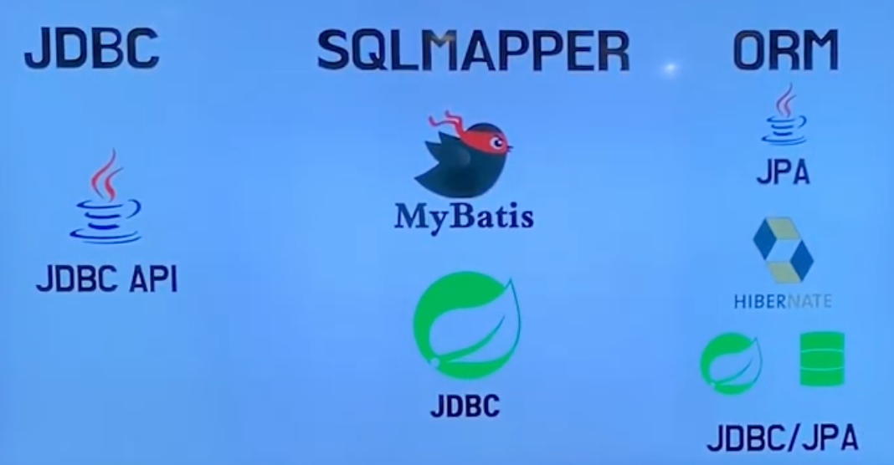
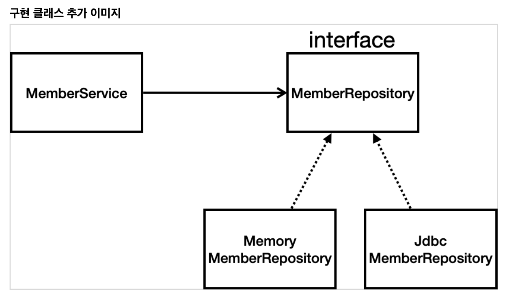

# 서론

오늘은 Spring 개발환경에서 DB에 접근하는 다양한 방법에 관해 알아보도록 하겠습니다.
이 글은 `김영한님의 스프링 입문 - 코드로 배우는 스프링 부트, 웹 MVC, DB 접근 기술`을 보고 정리한 글임을 서두에 밝힙니다.

<br>

# 본론

## 테스트 데이터베이스

먼저, DB 접근 기술을 다루기에 앞서 테스트 DB 환경을 구축하도록 하겠습니다. 이번에 사용할 DB는 `H2 데이터베이스`입니다. H2 데이터베이스는 테스트용 DB로 사용하기 쉽기 때문에 자주 사용합니다.

### 환경설정 방법

[해당 링크](https://www.h2database.com/html/main.html)에 접속하여, OS에 맞게 다운로드를 해줍니다. 저는 Mac을 사용하므로, All Platforms를 선택하겠습니다.

- zip 파일을 열어, 압축을 해제하신 후 파일을 열어봅니다.

그러면 bin, build.bat, build.iml, build.sh, docs, service, src이란 파일과 디렉토리가 생성된 걸 확인하실 수 있습니다.

- (Mac 이용자는) 사용 권한 부여를 합니다.

`chmod 755 h2.sh`를 입력해, 실행 권한을 부여해줍니다. 만약 입력하지 않으면 `zsh: permission denied: ./h2.sh`란 에러메세지가 출력됩니다.

- h2.sh 파일을 실행해줍니다.

권한 부여까지 끝났다면 bin 디렉토리로 이동해, 터미널에 `./h2.sh`를 실행해줍니다. 사용자 디렉토리에 `test.mv.db` 파일이 생성됐는지 확인해줍니다.


또 브라우저가 실행되면서 자동으로 입력된 IP 주소를 localhost로 변경해줍니다. 그러면 아래와 같이, H2 console 화면이 뜨게 됩니다. JDBC URL을 jdbc:h2:tcp://localhost/~/test로 입력해줍니다. 만약 h2 폴더의 경로가 다운로드 폴더 경로라면, 사용자 디렉토리(~)로 변경해줍니다.

### Tip

 작성한 sql문들은 sql 폴더를 만들어, 해당 디렉토리 안에 보관하는 편이 좋습니다.

<br>

# 스프링 DB 접근 기술



스프링 DB 접근 기술에는 크게 3가지가 있습니다. JDBC, SQLMAPPER, ORM. 언급된 순서가 빠를수록 오래된 기술이며, 시간의 흐름에 따라 각 기술의 단점을 보완하며 진화했기 때문에 기술이 탄생하게 된 배경을 이해하는 것이 중요합니다.

먼저, 세 기술의 공통점은 아래와 같습니다.

- 공통점
  - 모두 Persistance(영속성)과 관련됩니다. 영속성이란 휘발성 메모리인 RAM에 저장하지 않고, 영구히 저장될 수 있는 Database 혹은 파일에 저장하는 방식을 말합니다. 여기선 DB에 해당하겠죠.

## 순수 JDBC (JDBC)

먼저 순수 JDBC입니다. 무려 1994년에 나온 기술입니다. JDBC란 Java Database Connectivity의 약자로, 자바로 DB에 접속할 수 있도록 API 형태의 인터페이스를 제공하는 기술입니다.

### 설치 방법

실제로 설치 후, 실행해보면서 알아보겠습니다.

먼저 JDBC를 사용하려면, JDBC 드라이버가 필요합니다. 저희는 Spring-boot 환경에서 gradle로 JDBC를 다루고 있으므로 `build.gradle` 파일에 아래와 같이, spring-boot-stater-jdbc를 추가해줍니다. 또, 앞서 설치한 h2 데이터베이스도 추가로 설치해줍니다.

```java
// build.gradle 파일
dependencies {
  ...
	implementation 'org.springframework.boot:spring-boot-starter-jdbc'
	runtimeOnly 'com.h2database:h2'
  ...
}
```

또 스프링 부트의 데이터베이스 연결 설정도 추가해줍니다.

```java
// application.properties
spring.datasource.url=jdbc:h2:tcp://localhost/~/test
spring.datasource.driver-class-name=org.h2.Driver
spring.datasource.username=sa
```

이제 gradle에 종속성을 추가해주면 끝입니다. 잘 설치가 완료됐죠? 본격적으로 DB 연결을 위한 코드를 아래에서 작성해주겠습니다.

### 코드 작성

순수 JDBC로 DB 관리를 하는 코드들은 아래와 같습니다. Connection, PreparedStatement, ResultSet 등이 눈에 띄네요. 추후 학습해서 따로 해당 내용만 다뤄보도록 하겠습니다. 간략하게 보면,

- getConnection 메소드를 통해 DB 연결을 합니다.
- PreparedStatement를 통해 sql을 등록하고 ID도 등록해줍니다.
- ResultSet에 결과 값을 받아와, 알맞은 형태로 반환해줍니다. (ex - findAll 같은 경우, List 형태로 반환)

```java
package [패키지명].repository;
import [패키지명].domain.Member;
import org.springframework.jdbc.datasource.DataSourceUtils;
import javax.sql.DataSource;
import java.sql.*;
import java.util.ArrayList;
import java.util.List;
import java.util.Optional;
public class JdbcMemberRepository implements MemberRepository {
    private final DataSource dataSource;

    public JdbcMemberRepository(DataSource dataSource) {
        this.dataSource = dataSource;
    }

    @Override
    public Member save(Member member) {
        String sql = "insert into member(name) values(?)";
        Connection conn = null;
        PreparedStatement pstmt = null;
        ResultSet rs = null;
        try {
            conn = getConnection();
            pstmt = conn.prepareStatement(sql,
                    Statement.RETURN_GENERATED_KEYS);
            pstmt.setString(1, member.getName());
            pstmt.executeUpdate();
            rs = pstmt.getGeneratedKeys();
            if (rs.next()) {
                member.setId(rs.getLong(1));
            } else {
                throw new SQLException("id 조회 실패");
            }
            return member;
        } catch (Exception e) {
            throw new IllegalStateException(e);
        } finally {
            close(conn, pstmt, rs);
        }
    }

    @Override
    public Optional<Member> findById(Long id) {
        String sql = "select * from member where id = ?";
        Connection conn = null;
        PreparedStatement pstmt = null;
        ResultSet rs = null;
        try {
            conn = getConnection();
            pstmt = conn.prepareStatement(sql);
            pstmt.setLong(1, id);
            rs = pstmt.executeQuery();
            if(rs.next()) {
                Member member = new Member();
                member.setId(rs.getLong("id"));
                member.setName(rs.getString("name"));
                return Optional.of(member);
            } else {
                return Optional.empty();
            }
        } catch (Exception e) {
            throw new IllegalStateException(e);
        } finally {
            close(conn, pstmt, rs);
        }
    }

    @Override
    public List<Member> findAll() {
        String sql = "select * from member";
        Connection conn = null;
        PreparedStatement pstmt = null;
        ResultSet rs = null;
        try {
            conn = getConnection();
            pstmt = conn.prepareStatement(sql);
            rs = pstmt.executeQuery();
            List<Member> members = new ArrayList<>();
            while(rs.next()) {
                Member member = new Member();
                member.setId(rs.getLong("id"));
                member.setName(rs.getString("name"));
                members.add(member);
            }
            return members;
        } catch (Exception e) {
            throw new IllegalStateException(e);
        } finally {
            close(conn, pstmt, rs);
        }
    }

    @Override
    public Optional<Member> findByName(String name) {
        String sql = "select * from member where name = ?";
        Connection conn = null;
        PreparedStatement pstmt = null;
        ResultSet rs = null;
        try {
            conn = getConnection();
            pstmt = conn.prepareStatement(sql);
            pstmt.setString(1, name);
            rs = pstmt.executeQuery();
            if(rs.next()) {
                Member member = new Member();
                member.setId(rs.getLong("id"));
                member.setName(rs.getString("name"));
                return Optional.of(member);
            }
            return Optional.empty();
        } catch (Exception e) {
            throw new IllegalStateException(e);
        } finally {
            close(conn, pstmt, rs);
        }
    }
    private Connection getConnection() {
        return DataSourceUtils.getConnection(dataSource);
    }

    private void close(Connection conn, PreparedStatement pstmt, ResultSet rs)
        {
            try {
                if (rs != null) {
                    rs.close();
                }
            } catch (SQLException e) {
                e.printStackTrace();
            }
         try {
            if (pstmt != null) {
                pstmt.close();
            }
        } catch (SQLException e) {
            e.printStackTrace();
        }
            try {
            if (conn != null) {
                close(conn);
            }
        } catch (SQLException e) {
            e.printStackTrace();
        }}

    private void close(Connection conn) throws SQLException {
        DataSourceUtils.releaseConnection(conn, dataSource);
    }
}
```

### 설정방법

기존 Interface에서 구현체만 바꿔, 끼워주면 됩니다. 아래와 같이 말이죠.



```java
import org.springframework.context.annotation.Bean;
import org.springframework.context.annotation.Configuration;
import [패키지명].domain.MemoryMemberRepository;
import [패키지명].repository.MemberRepository;
import [패키지명].service.MemberService;

@Configuration
public class SpringConfig {
    @Bean
    public MemberService memberService(){
        return new MemberService(memberRepository());
    }

    @Bean
    public MemberRepository memberRepository(){
        return new MemoryMemberRepository();
    }
}
```

그리고 위와 같은 방식에서 아래와 같은 방식으로, SpringConfing.java 파일을 수정/등록해줍니다.

```java
import org.springframework.context.annotation.Bean;
import org.springframework.context.annotation.Configuration;
import [패키지명].repository.JdbcMemberRepository;
import [패키지명].repository.MemoryMemberRepository;
import [패키지명].repository.MemberRepository;
import [패키지명].service.MemberService;

import javax.sql.DataSource;

@Configuration
public class SpringConfig {

    private final DataSource dataSource;

    public SpringConfig(DataSource dataSource){
        this.dataSource = dataSource;
    }

    @Bean
    public MemberService memberService(){
        return new MemberService(memberRepository());
    }

    @Bean
    public MemberRepository memberRepository(){
        return new JdbcMemberRepository(dataSource);
    }
}
```

### 장점과 단점

- 장점
  - 오래된 기술이라, 이제 장점은 딱히 없습니다.
- 단점
  - 위에서 보았듯, DB 연결을 위해 작성해야 할 코드가 매우 많습니다.
  - DB 사용 후에는 DB Connection을 직접 해제해줘야 합니다.
  - 쿼리를 직접 작성해야 하므로, SQL 의존적인 개발을 하게 됩니다.

## Spring JDBC (JDBC 템플릿) => SQL Mapper

다음 다뤄볼 건 Spring JDBC 혹은 JDBC 템플릿라 불리는 기술입니다. SQL Mapper라고도 합니다. 이 기술은 DB 연결과 해제 작업을 대신 해주기 때문에, 작성해야 할 코드 수가 많이 줄어들게 됩니다.

### 코드작성

얼마나 줄어드냐구요? 한번 같이 보시죠. 생성 할 때 추가로 작성해줘야 하는 코드들을 제외하곤 확실히 줄어든게 느껴지시나요? 중간에 rowMapper란 기술이 등장하게 되는데, 지금은 값을 반환하기 쉽게 변형해주는 요소라고 이해하고 넘어가시면 될 것 같습니다.

```java
package [패키지명].repository;

import org.springframework.jdbc.core.JdbcTemplate;
import org.springframework.jdbc.core.RowMapper;
import org.springframework.jdbc.core.namedparam.MapSqlParameterSource;
import org.springframework.jdbc.core.simple.SimpleJdbcInsert;
import [패키지명].domain.Member;

import javax.sql.DataSource;
import java.sql.ResultSet;
import java.sql.SQLException;
import java.util.HashMap;
import java.util.List;
import java.util.Map;
import java.util.Optional;

public class JdbcTemplateMemberRepository implements MemberRepository {

    private final JdbcTemplate jdbcTemplate;

    // 생성자 하나면 @Autowired 생략 가능함
    public JdbcTemplateMemberRepository(DataSource dataSource){
        jdbcTemplate = new JdbcTemplate(dataSource);
    }

    @Override
    public Member save(Member member) {
        SimpleJdbcInsert jdbcInsert = new SimpleJdbcInsert(jdbcTemplate);
        jdbcInsert.withTableName("member").usingGeneratedKeyColumns("id");

        Map<String, Object> parameters = new HashMap<>();
        parameters.put("name", member.getName());

        Number key = jdbcInsert.executeAndReturnKey(new MapSqlParameterSource(parameters));
        member.setId(key.longValue());
        return member;
    }

    @Override
    public Optional<Member> findById(Long id) {
        List<Member> result = jdbcTemplate.query("select * from member where id = ?", memberRowMapper(), id);
        return result.stream().findAny();
    }

    @Override
    public Optional<Member> findByName(String name) {
        List<Member> result = jdbcTemplate.query("select * from member where name = ?", memberRowMapper(), name);
        return result.stream().findAny();
    }

    @Override
    public List<Member> findAll() {
        return jdbcTemplate.query("select * from member", memberRowMapper());
    }

    private RowMapper<Member> memberRowMapper(){
        return (RowMapper<Member>) (rs, rowNum) -> {
            Member member = new Member();
            member.setId(rs.getLong("id"));
            member.setName(rs.getString("name"));
            return member;
        };
    }
}
```

### 장점과 단점

- 장점
  - DB 관리를 Jdbc Template에서 알아서 해준다.
- 단점
  - 여전히 쿼리를 따로 작성해줘야 한다.

## MYBATIS => SQL Mapper

다음은 또 다른 SQL Mapper인 MyBatis 입니다. (MyBatis의 경우, 예문이 준비되어 있지 않아 향후 추가해놓겠습니다. )

### 장점과 단점

장점과 단점은 아래와 같습니다.

- 장점
  - SQL 문을 Java로부터 분리하여, XML에서 모두 관리함으로써 개발자가 실수할 여지를 줄여줬다.
- 단점
  - 물리적으로 SQL과 JDBC API를 데이터 접근 계층에 숨기는 것까진 성공했지만, 논리적으로는 여전히 엔티티와 아주 강한 의존 관계를 갖음.

## JPA => ORM

다음은 대망의 JPA입니다. JPA는 Java Persistence API의 약자로, 자바 진영의 ORM 기술 표준이자 인터페이스의 모음을 명명합니다. JPA 표준 인터페이스가 있고 내부적으론 Hibernate란 구현한 구현체가 존재합니다. (자세한 내용은 추후 다뤄보겠습니다.)

ORM이란 Object Relational Mapping의 약자로, 객체와 관계형 데이터베이스의 데이터를 자동으로 매핑(연결)해주는 것을 말합니다. 이를 사용하면, 개발자들은 자바 코드 만으로도 SQL 문을 다룰 수 있게 됩니다. 이를 통해, 객체지향적 관점을 갖고 DB를 관리할 수 있어, 개발 생산성이 높아지는 결과가 나타납니다.

### 환경설정 방법

백문이 불여일타죠. 한번 바로 써보겠습니다. 먼저 아래와 같이, gradle에 `spring-boot-starter-data-jpa`를 추가해줍니다.

```java
// build.gradle 파일
dependencies {
  ...
	implementation 'org.springframework.boot:spring-boot-starter-data-jpa'
  ...
}
```

JPA가 작성한 SQL을 콘솔에서 확인하기 위해 `spring.jpa.show-sql` 설정도 해줍니다.
`spring.jpa.hibernate.ddl-auto=create`라고 설정하면, 처음 DB 생성을 자동으로 해줍니다.

```java
// application.properties
spring.jpa.show-sql=true
spring.jpa.hibernate.ddl-auto=create
```

### 코드 작성

```java
package [패키지명].domain;
import javax.persistence.*;

@Entity
public class Member {
    @Id @GeneratedValue(strategy = GenerationType.IDENTITY)
    private Long id;

    private String name;

    public Long getId() {
        return id;
    }
    public void setId(Long id) {
        this.id = id;
    }
    public String getName() {
        return name;
    }
    public void setName(String name) {
        this.name = name;
    }
}
```

기존 Entity에 @Entity 어노테이션을 추가해줍니다. 이를 통해, JPA에서 해당 엔티티를 관리할 수 있게 됩니다.
또 PK를 매핑해주기 위해, @Id를 추가해줍니다. DB에서 key 값을 자동으로 추가해줄 수 있도록 @GeneratedValue을 등록해주고, strategy는 IDENTITY로 설정해줍니다.

```java
package [패키지명].repository;

import [패키지명].domain.Member;

import javax.persistence.EntityManager;
import javax.persistence.TypedQuery;
import java.util.List;
import java.util.Optional;

public class JpaMemberRepository implements MemberRepository {

    private final EntityManager em;

    public JpaMemberRepository(EntityManager em){
        this.em = em;
    }

    @Override
    public Member save(Member member) {
        em.persist(member);
        return member;
    }

    @Override
    public Optional<Member> findById(Long id) {
        Member member = em.find(Member.class, id);
        return Optional.ofNullable(member);
    }

    @Override
    public Optional<Member> findByName(String name) {
        List<Member> result = em.createQuery("select m from Member m where m.name = :name", Member.class).setParameter("name", name).getResultList();
        return result.stream().findAny();
    }

    @Override
    public List<Member> findAll() {
        return em.createQuery("select m from Member m", Member.class).getResultList();
    }
  }
```

JPA 코드는 위와 같습니다. 코드 양이 줄어든 게 눈에 보이시나요? save와 find의 경우엔 Query도 따로 작성해줄 필요가 없어졌습니다.

또 동작원리는 다음과 같습니다. JPA는 EntityManager로 모든게 동작됩니다. 앞서, build.gradle 파일에서 `spring-data-jpa` 추가해주면, 스프링 부트는 EntityManager를 생성하고 EntityManager는 DB 연결 및 쿼리 작성 등을 자동으로 처리해줍니다.

### 설정방법

마지막으로 SpringConfig.java 파일에서 기존 연결설정을 JPA로 변경해주면 끝입니다! EntityManager가 추가된 게 보이시죠?

```java
import org.springframework.context.annotation.Configuration;
import [패키지명].repository.JdbcMemberRepository;
import [패키지명].repository.JdbcTemplateMemberRepository;
import [패키지명].repository.JpaMemberRepository;
import [패키지명].repository.MemberRepository;
import [패키지명].service.MemberService;

import javax.persistence.EntityManager;
import javax.sql.DataSource;

@Configuration
public class SpringConfig {

    private final DataSource dataSource;
    private final EntityManager em;

    @Autowired
    public SpringConfig(DataSource dataSource, EntityManager em){
        this.dataSource = dataSource;
        this.em = em;
    }

    @Bean
    public MemberRepository memberRepository(){
        // return new MemoryMemberRepository();
        // return new JdbcMemberRepository(dataSource);
        // return new JdbcTemplateMemberRepository(dataSource);
        return new JpaMemberRepository(em);
    }
}
```

### 장점과 단점

- 장점
  - SQL에 의존적인 개발 패러다임에서 벗어날 수 있다.
  - 기본적인 쿼리를 작성해줄 필요가 없다. 기본적인 CRUD 기능을 JPA를 통해, 처리할 수 있기 때문이다.
  - 스프링 데이터 JAP를 쓰면, JDPARepository extends하면 Injection이 자동으로 처리됨.
- 단점
  - 복잡한 쿼리는 개발자가 직접 작성해야 합니다. 그래도 이전에 비해선, 횔씬 낫죠.

## Spring Data JPA

대망의 마지막, Spring Data JPA 입니다. 스프링 데이터 JPA를 사용하면, 리포지토리에 구현 클래스 없이 인터페이스 만으로 개발을 완료할 수 있어 JPA보다도 생산성이 증가하게 됩니다. 이미 JPA 설정이 완료됐으므로, 바로 코드로 보여드리겠습니다.

### 코드작성

```java
package [패키지명].repository;

import org.springframework.data.jpa.repository.JpaRepository;
import [패키지명].domain.Member;

import java.util.Optional;

public interface SpringDataJpaMemberRepository extends JpaRepository<Member, Long>, MemberRepository {
    @Override
    Optional<Member> findByName(String name);
}
```

앞서 작성한 코드에서 이만큼이나 줄었습니다.. 놀랍지 않나요? 내부적으로 CRUD와 같은 기본적인 로직을 구현했고 바로 사용할 수 있게 처리됐기 때문에 가능한 일입니다.

### 환경설정

설정도 변경해주죠.

```java
// SpringConfig.java
@Configuration
public class SpringConfig {

    private final MemberRepository memberRepository;
    public SpringConfig(MemberRepository memberRepository){
        this.memberRepository = memberRepository;
    }

    @Bean
    public MemberService memberService(){
        return new MemberService(memberRepository);
    }
}
```

### 장점과 단점

- 장점
  - 스프링 데이터 JPA는 기본적인 CRUD 처리까지 해준다.
  - findByName 같은 경우도 인터페이스 만으로 구현이 끝난다. 내부적으론 JPQL (select m from Member m where m.name = ?)과 같은 쿼리를 날린다.
- 단점
  - 여전히 복잡한 쿼리는 직접 작성해줘야 합니다. (그 방법에 관해선 추후에 더 알아보겠습니다.)

# 마무리

이것으로 Spring 환경에서의 DB 접근 방법에 대해서 간략하게 알아보았습니다. 읽어주셔서 감사합니다.
