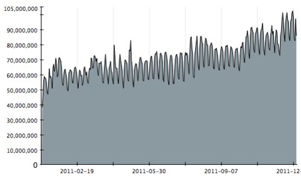

### 대규모 서비스의 특성

- 많은 사용자 트래픽
- 많은 상요자 데이터
- 사용자 트래픽 / 데이터의 빠른 증가

### 사례

1. 페이스북

2012년 기준 하루에 500+ Terabytes

- 25억개의 컨텐츠
- 27억개의 Likes
- 3억개의 사진 업로드

2. bit.ly의 Click 사례

2011년 클릭 회수가 2배 이상 성장(실제 사람이 클릭한 경우만)

3. 2010-2011년 Netflix API 증가 사례

2010년 1월 10억 건의 API 요청에서 2011년 1월 200억 건의 API 요청으로, 1년 사이에 20배 증가하였음.

### 생각해보기

스타트업에서 서비스의 인기가 좋아 트래픽이 감당할 수 없을 정도로 늘어난다면, 그래서 몇일 동안 서비스가 안된다면 어떤 일이 벌어질까? 우리가 만드는 서비스는 앞에서 소개한 예의 트래픽/데이터의 증가에도 문제없이 서비스가 가능할까?

### 대규모 서비스가 가져야 할 특성

- **확장성**
  - 서비스의 가용용량을 늘이고 줄이는 것이 쉬워야 한다.
  - 하루에 서버를 몇 십대를 늘려야 하는 상황이 있을 수 있는데, 그런 작업을 해줘야 한다.
- **장애회복성**
  - 서비스에 장애가 일어났을 때 가능한 메뉴얼한 처리 없이 자동적으로 회복되어야 한다.
  - 예를 들면, 웹 서버 장애가 났다고 하자. 사람이 직접 영향을 줄이기 위해 서비스 영역에서 제외해주는 작업을 해선 안된다.
- **자동화**
  - 배포부터 장애처리 등 대부분 자동화 되어서 버튼 클릭 한 두번 정도로 진행되어야 한다.
    - 장애처리란 문제가 되는 서버를 서비스 영역에서 제외하는 것을 말함.
  - 확장성과 장애회복성이 되려면, 결국 자동화가 되어야 한다. 인프라를 새롭게 구성하거나, 추가하고 줄이는 과정이 자동화되어 있어야 합니다.
- **모니터링**
  - 서비스 상태는 항상 모니터링 되어야 한다.

### 확장성에서 고민해봐야 하는 상황들

1. 트래픽이 늘어나서 서버를 추가해야 한다면?
2. 트래픽이 줄어서 서버를 줄여야 한다면?

- 웹서버/DB 서버, 웹 서버보단 DB 서버를 줄이기 더 어렵다.
- 서버의 추가와 제거는 똑같은 상황이지만, 서버를 줄이는 것이 더 어려운 일이다. 기존 서버 데이터를 통합해야 하기 떄문이다.

### 장애회복성에서 고려해봐야 하는 상황들

서비스 중인 API 서버 한 두대가 장애가 나면 서비스는 계속 지속될 수 있을까요?
failover, replication 등이 이뤄져야 한다.

### 장애회복성(Resliency)

장애회복성을 위해선 SPOF(Single Point of Failure)가 없어야 합니다.
SPOF를 제거하려면, 모든 부분에서 최소 이중화가 되어야 합니다.
이 외에도 Switch, Route 등의 서버 외의 하드웨어 부분에서 문제가 발생할 수도 있습니다.

### Network의 Bandwidth 한계

10G 스위치에 10Gbps 이상의 데이터가 전달될 수 있을까? 만약 전달된다면, 그 순간부터 패킷 드랍이 발생됨.

### 대규모 서비스와 SPOF의 관계

SPOF를 최대한 제거하고, 각 부분들을 확장할 수 있어야 한다.

### 자동화

서비스 운영의 많은 부분이 자동화 되어야 한다.

- 사람이 손으로 직접 건드리는 것은 도리어 새로운 장애의 씨앗이 된다.
  IaC(Infrastructure as code)가 중요하다.

- On-Premis
  - On-Premis에서 장비의 준비는 인프라 팀의 도움이 꼭 필요하다.
  - 일부 기업에서는 이런 부분도 최대한 API를 통해 준비하기 위해 Private-Cloud 등을 도입하기도 한다.
  - OS와 기본적인 네트워크 설정 이외에 모든 설정을 설치 스크립트 하나로 처리 되어야 한다.
- Cloud
  - 필요한 인프라(서버, 그 외의 Cloud 제공 서비스)는 IaC로 생선한다.
    - Terraform이 가장 유명하고, Pulumi 등도 있다.
  - 특정 이미지를 모두 만들어 둘 수도 있고, Terraform으로 인프라를 구성한 후에 ansible로 필요한 설정을 할 수도 있다.
    - 주로 ansible-playbook을 통해 많은 부분을 스크립트로 처리할 수 있다. 
