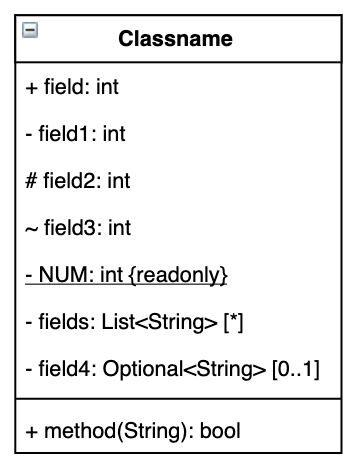
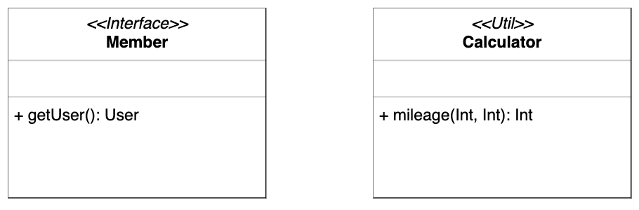
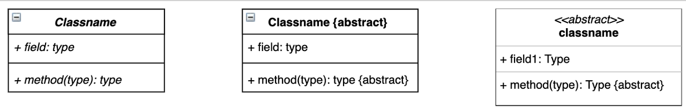
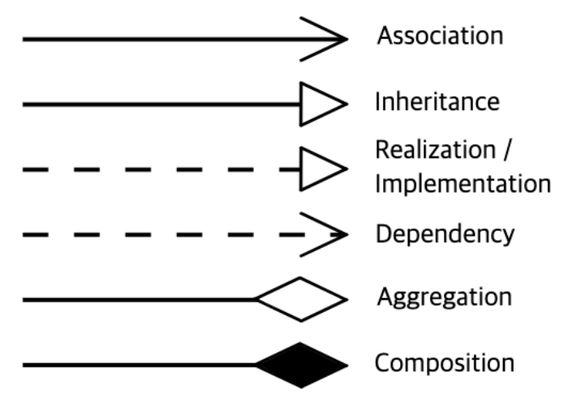
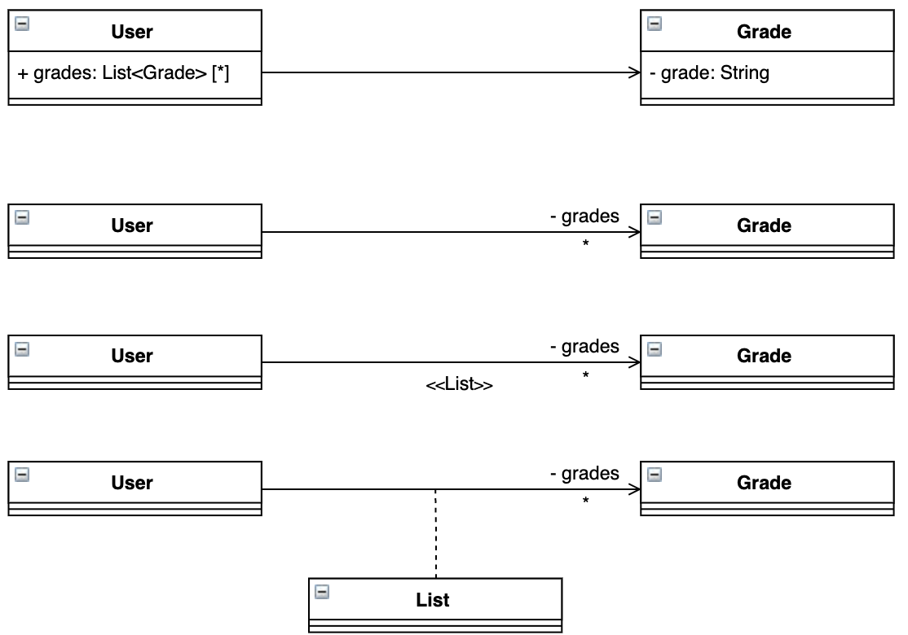
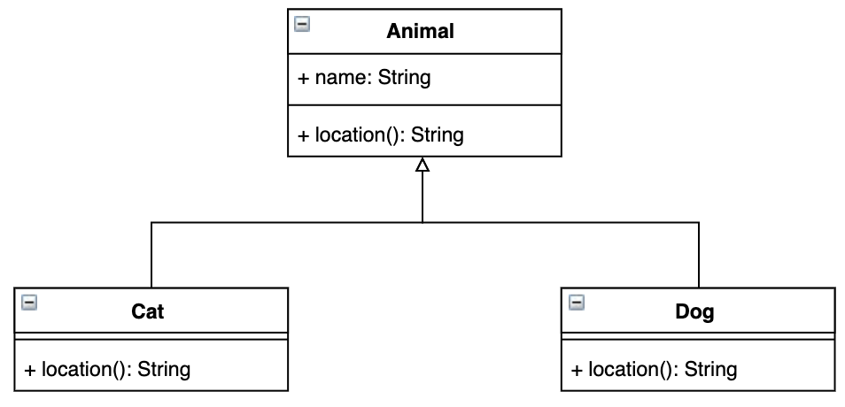
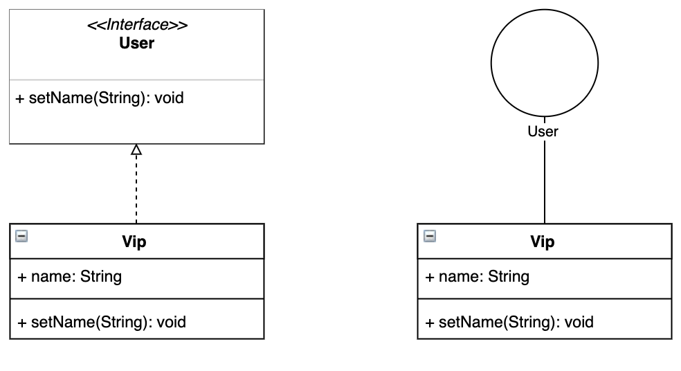
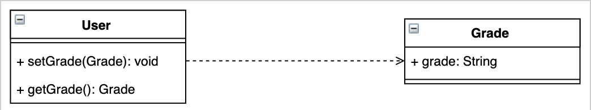
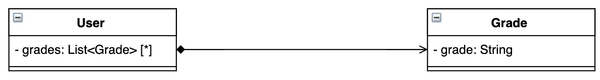

### 클래스 다이어그램

- 클래스 다이어그램
  - 정의
    - UML 중 하나로, 클래스 내부 구성요소 및 클래스 간의 관계를 도식화하여 시스템의 특정 모듈이나 일부 및 전체를 구조화
  - UML (Unified Modeling Language)
    - 시스템의 설계를 **시각화**하는 표준 방법을 제공하기 위한 소프트웨어 엔지니어링 분야의 범용 개발 모델링 언어
  - 그리는 이유
    - 시스템 내 클래스 간의 의존성 파악과 팀원들 간 의사소통이 편해지기 때문
  - 요소
    - 클래스
      - 이름
        - 필수적으로 입력해줘야 함.
      - 속성
      - 메소드
  - 다이어그램 예시  
    
  - 접근제어자에 대한 표현
    - (+) : public
    - (-) : private
    - (#) : protected
    - (~) : default
  - 스테레오 타입
    - 길러멧
      - 인터페이스나 추상 클래스와 같은 요소를 표기하기 위해 사용하는 << >> 와 같은 문법을 말함.
    - 다이어그램 예시  
      
  - 추상 클래스
    - 다이어그램 예시  
      
  - 클래스 간 관계
    
    - Association
      
      - 다른 객체의 참조를 가지고 있을 때, 이러한 연관 관계를 나타낸다. 방향이 있는 실선과 방향이 없는 실선 두 가지로 연관 관계를 나타낼 수 있습니다.
      - A → B 와 같이 방향이 있는 실선의 경우, A가 B를 참조한다는 의미입니다.
    - Inheritance  
      
      - 상속 관계를 나타냅니다. Generalization(일반화)라고도 많이 부릅니다. 부모 클래스와 자식 클래스 간의 상속 관계를 나타낼 때 주로 사용합니다.
    - Realization / Implementation  
      
      - 인터페이스를 상속하여 클래스에서 실제 기능을 실현화 할 때 사용합니다.
    - Dependency
      
      - 클래스 간 참조 관계를 나타낼 떄, 사용합니다. Association과의 차이점으로는 Association은 변수로 다른 클래스와 연관이 있을 때, 사용하고 Dependency는 메소드의 파라미터나 반환에 사용되는 클래스 관계를 나타낼 때 사용합니다.
    - Aggregation
      - 집합 관계를 나타낼 때 사용합니다.
    - Composition
      
      - Aggregation과 비슷하게 전체 - 부분의 집합 관계를 나타낼 때 사용하지만 Aggregation보다는 더 강력한 집합을 의미할 때 사용합니다. 합성 관계에서는 부분이 전체에 종속적이고 라이프 사이클을 관리한다라고 볼 수 있습니다.

### 참고한 사이트

[https://brownbears.tistory.com/577](https://brownbears.tistory.com/577)
