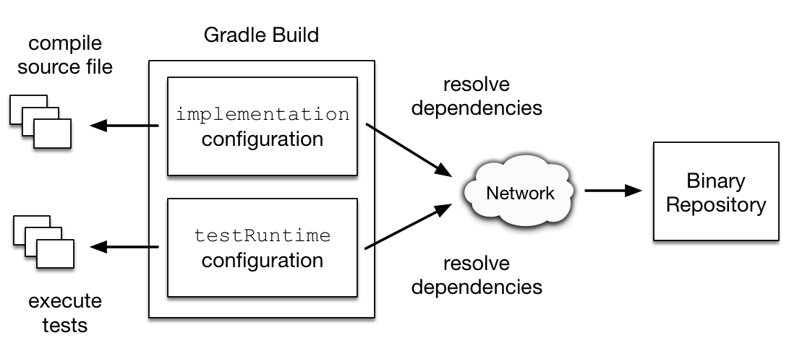

# 본론

### 의존성 옵션들

- api : This is where you declare dependencies which are transitively exported to consumers, for compile time and runtime.

- implementation : This is where you declare dependencies **which are purely internal and not meant to be exposed to consumers (they are still exposed to consumers at runtime)**.

- compileOnly : This is where you declare dependencies which are **required at compile time, but not at runtime**. This typically includes dependencies which are shaded when found at runtime.

- compileOnlyApi : This is where you declare dependencies **which are required at compile time by your module and consumers, but not at runtime**. This typically includes dependencies which are shaded when found at runtime.

- runtimeOnly : This is where you declare dependencies **which are only required at runtime, and not at compile time**.

- testImplementation : This is where you declare dependencies **which are used to compile tests**.

- testCompileOnly : This is where you declare dependencies which are only required at test compile time, but should not leak into the runtime. **This typically includes dependencies which are shaded when found at runtime**.

- testRuntimeOnly : This is where you declare dependencies **which are only required at test runtime, and not at test compile time**.

# 참고한 사이트

[https://docs.gradle.org/current/userguide/declaring_dependencies.html](https://docs.gradle.org/current/userguide/declaring_dependencies.html)
