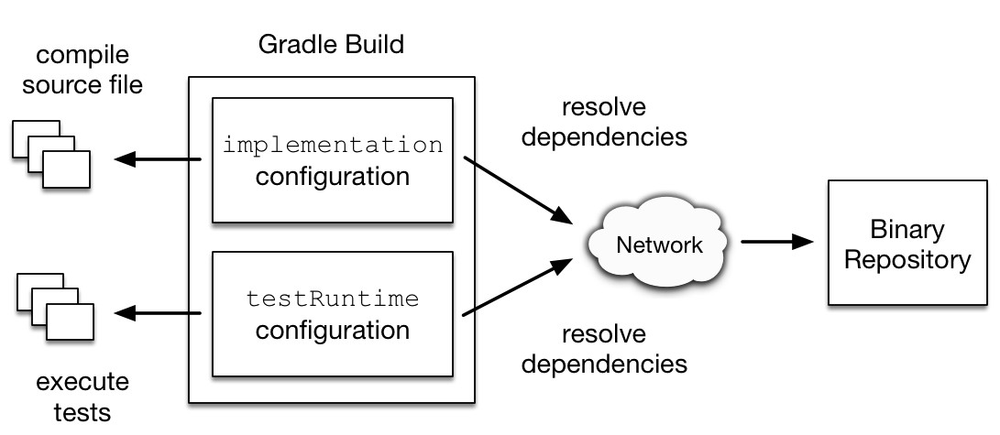

# 본론

오늘은 build.gradle 파일의 구성 요소들을 하나씩 뜯어보며, 각각 어떤 의미를 갖는지 파악해보도록 하겠습니다.

### 의존성 정보 구성

```groovy
// Package:Artifact:Version
androidx.compose.ui:ui-tooling-preview:1.0.0
```

- 구성
  - Package
    - 소스코드가 작성된 패키지 명
  - Artifact
    - 라이브러리의 고유한 명칭
  - Version
    - 버젼 정보

### 의존성 범위

어플리케이션을 개발할 때 릴리즈, 디버그, 테스트 등 범위(scope) 별로 다른 라이브러리를 넣는다. 이렇게
의존성 범위를 나누는 까닭은 릴리즈용 빌드 파일에 불필요한 의존성을 추가하지 않음으로써, 빌드 파일의 크기를 줄이기 위함이다.

- compile : 컴파일 및 런타임
  - implementation
    - 의존 라이브러리 수정시 본 모듈까지만 재빌드
  - api
    - 의존 라이브러리 수정시 해당 모듈을 의존하고 있는 모듈들 또한 재빌드
- complieOnly : (런타임을 제외한) 컴파일 할 때만 적용됨
  - compileOnlyApi
- debug : 디버그 모드에서 적용됨
  - debugImplementation
- runtime : 런타임 할 때만 적용됨
  - runtimeOnly
- test : 테스트 할 때 적용됨
  - testCompileOnly
    - 테스트 컴파일 시에만 적용됨
  - testRuntimeOnly
    - 테스트 파일 실행 시에만 적용됨
  - testImplementation
    - 테스트 파일에 적용됨
- android test
  - androidTestImplementation
    - 안드로이드 테스트가 수행될 때 적용됨



# 참고한 사이트

[https://stackoverflow.com/a/44419574](https://stackoverflow.com/a/44419574)
[https://kotlinworld.com/316](https://kotlinworld.com/316)
[https://docs.gradle.org/current/userguide/declaring_dependencies.html](https://docs.gradle.org/current/userguide/declaring_dependencies.html)
