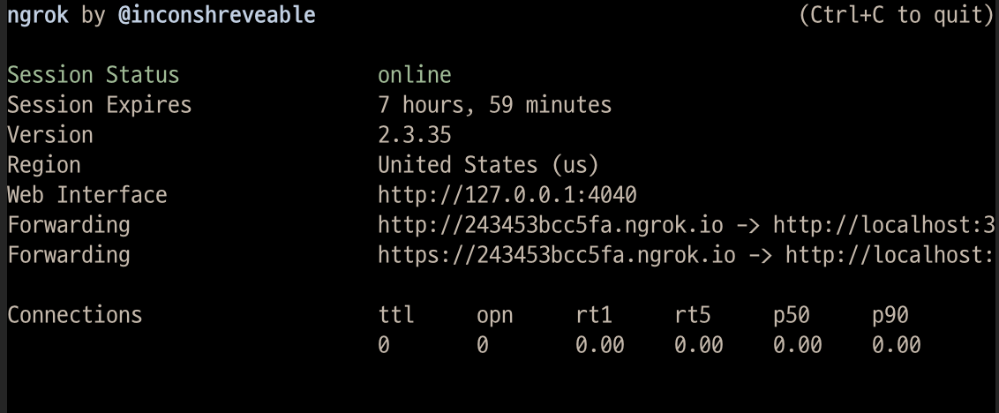

# 서론

오늘은 개발 및 테스트 과정에서 간단하게 로컬 API를 외부 URL로 쉽게 배포하여 사용할 수 있도록 돕는 툴인 `ngrok`에 대해서 알아보도록 하겠습니다.

### ngrok의 필요성

로컬에 구성한 개발 환경을 급하게 외부에 공개해야 할 경우가 있습니다. 예로 갑자기 외부에서 중요한 고객에게 개발중인 제품을 시연해야 하거나 개발 단계에서 social login 연동등 web hook 을 수신해야 할 경우 domain 을 부여하고 외부에 공개해야 하는데 이를 위해서는 별도의 개발 서버로 옮기고 build와 deploy 를 하는 번거로운 과정을 거쳐야 합니다. 개발용 로컬 호스트를 tunneling을 통해(Secure tunnels to localhost) 외부에서 연결할 수 있도록 해주는 ngrok를 사용하면 쉽고 빠르게 로컬 개발 환경을 외부에 공개할 수 있습니다.

### 설치 및 사용방법

https://ngrok.com/download 에 연결하면 운영 체제별로 zip 으로 압축한 패키지를 제공하므로 다운받아서 압축을 해제하고 PATH 에 걸린 폴더에 넣은 후에 사용하면 됩니다.

저는 Mac 환경에서 brew 패키지 관리자를 사용하므로 다음 명령어로 직접 설치했습니다.

```shell
brew install --cask ngrok
```

ngrok http port번호 만 입력하면 끝!

```shell
ngrok http 3500
```

위처럼 입력하면, localhost:3500에 대한 임의 주소를 설정해줍니다.



이렇게 https 주소 뿐만 아니라 http용 주소도 얻을 수 있습니다. 2번째 줄을 보면 세션 만료까지의 시간도 나와있습니다.

# 참고한 사이트

[https://www.lesstif.com/software-architect/ngrok-39126236.html](https://www.lesstif.com/software-architect/ngrok-39126236.html)
[https://velog.io/@yujuck/ngrok-%EC%82%AC%EC%9A%A9%ED%95%98%EB%A9%B4-%EC%99%B8%EB%B6%80%EC%97%90%EC%84%9C-%EB%A1%9C%EC%BB%AC%EC%84%9C%EB%B2%84-%EC%A0%91%EA%B7%BC-%EA%B0%80%EB%8A%A5](https://velog.io/@yujuck/ngrok-%EC%82%AC%EC%9A%A9%ED%95%98%EB%A9%B4-%EC%99%B8%EB%B6%80%EC%97%90%EC%84%9C-%EB%A1%9C%EC%BB%AC%EC%84%9C%EB%B2%84-%EC%A0%91%EA%B7%BC-%EA%B0%80%EB%8A%A5)
